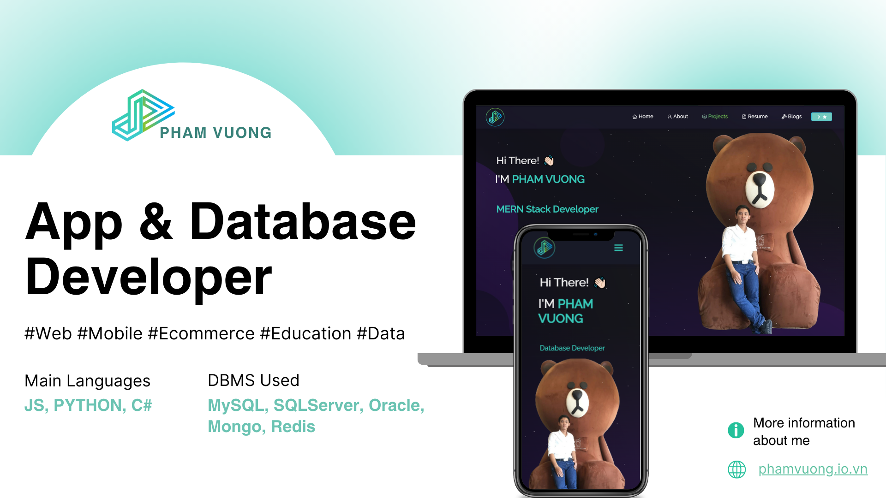
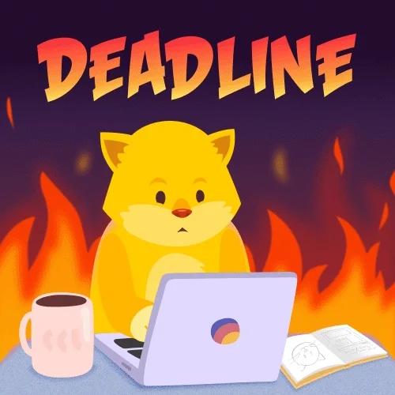

<h2 align="left">Hi 👋! My name is Pham Vuong and I'm a Backend Developer, from Ho Chi Minh City, Viet Nam  </h2>

  

 

  
  

###

###

       
      
      
      
       
      
      
      
      
      
      

###

  
  
  
  
  
  

###

 

### Show your support

  Give a ⭐ if you like my projects!

  

